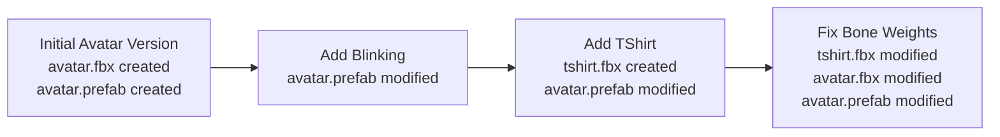
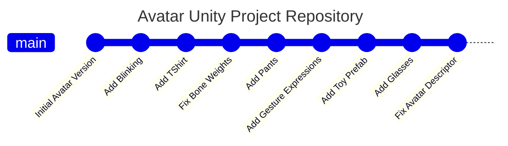
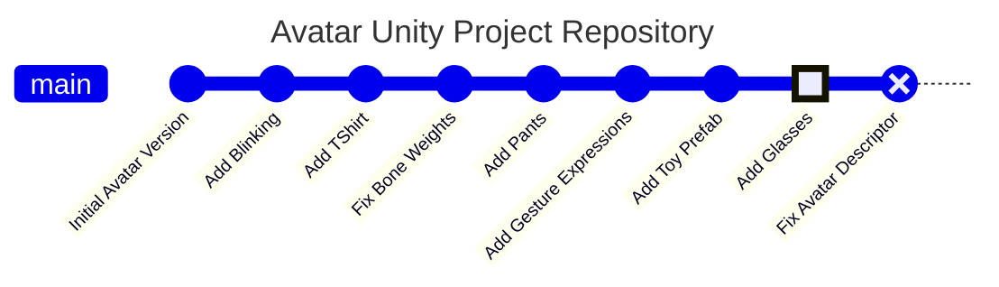
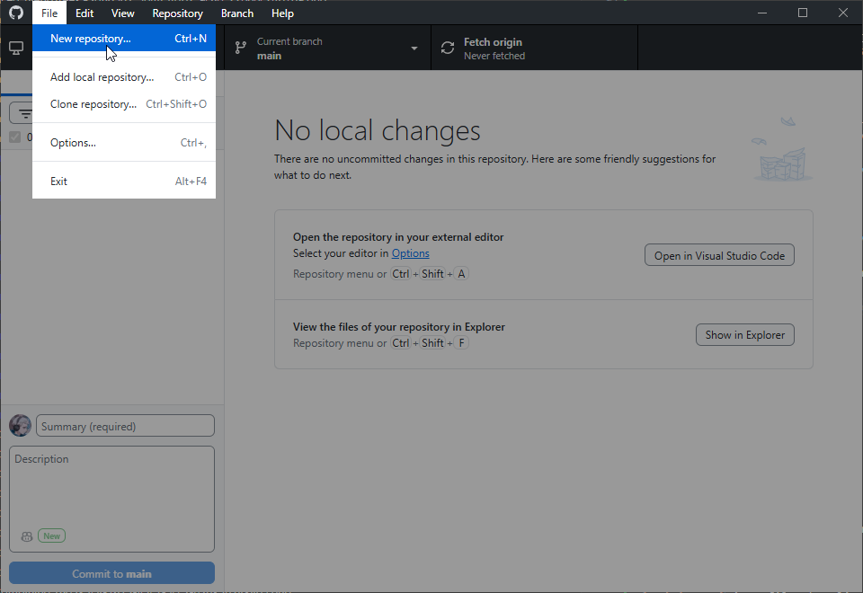
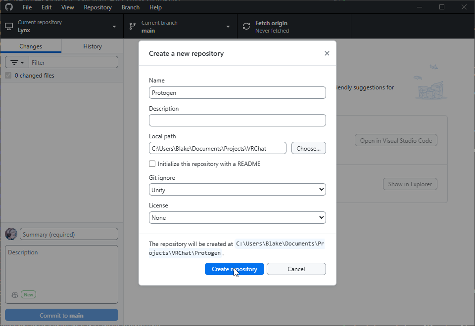

Contributors: [Twinki](https://github.com/Twinki14)

## Version Control
Version control, also referred to as source control, is the practice of tracking and managing changes to a collection of files.

It's typically used for software development where files are mostly text, but it can also be used for projects like Unity that contain many binary files such as textures, models, or materials.

Version control enables history tracking of changes made to a collection of files.



## Git
[A very popular open-source version & source control system](https://git-scm.com/about), you've interacted with it in some way if you've ever viewed a GitHub repository. This very page is stored in a Git repository.

- In **Unity**, a **collection files** is usually a Unity Project, such as a World or Avatar.
- In **Git**, a **collection of files** is a Repository,
  - A saved set of changes to that repository is a Commit.
  - The chronological sequence of those commits form the Commit History.



- Every commit records the files **added**, **modified**, or **deleted** in the repository since the **previous commit**.
- For existing files, a **commit includes only the changes made to that file**.
- Browsing the **commit history** will display what changes had been made since the **previous commit**.

Our **commit history** enables us to easily **checkout** of any commit in our commit tree.

If after adjusting our Avatar Descriptor in `Fix Avatar Descriptor`, our Avatar for some reason broke, we could **checkout** of the previous commit `Add Glasses` and determine what may have gone wrong, or even get us back to a working avatar in the meantime.



In short, every **commit** in a **repository** is a recorded point-in-time (a "version") and we as the user can go forwards or backwards to any **commit** we want.

### Diffs
Commits in Git represent changes made since the previous commit — this is what Git actually stores.

For text-based files, such as source code, storing the textual difference is preferred, as it makes it easier to browse our commit tree.

For binary files (e.g.,`.png`, `.spp`, `.fbx`, `.obj`, `.jpeg`), which make up the majority of a Unity project, Git by default stores the entire file contents in each commit. This isn't ideal, because binary files cannot be efficiently diffed like text files, leading to very large repository histories that can quickly consume a lot of storage.

For Unity Projects, we need an extra solution

## Git LFS
[Git LFS](https://git-lfs.com/) enables storing specific file types inside a repository as textual-pointers instead of flat-diffs as a Git extension.

This makes our repository far more space-efficient


## Setting up a Git Repository for your VRC Avatar Unity Project

This assumes you already have a Unity Project created, and are mainly using it for Avatar(s) creation

### Installing Git
- [Git for Windows](https://git-scm.com/install/windows)
- [Git LFS extension for Windows](https://git-scm.com/install/windows)
  - Only follow Step #1

### Git clients
- [GitHub Desktop - Begineer friendly](https://desktop.github.com/download/)
- [Fork - Less begineer friendly](https://git-fork.com/)

### Creating the repository

#### With GitHub Desktop
<details>
<summary>GitHub Desktop</summary>

Assuming our project is located in `~\Documents\Projects\VRChat\Protogen`

<div class='notion-row'>
<div class='notion-column' style={{width: 'calc((100% - (min(32px, 4vw) * 1)) * 0.5)'}}>


**File -> New Repository**

</div><div className='notion-spacer'></div>

<div class='notion-column' style={{width: 'calc((100% - (min(32px, 4vw) * 1)) * 0.5)'}}>





</div><div className='notion-spacer'></div>
</div>


<div class='notion-row'>
<div class='notion-column' style={{width: 'calc((100% - (min(32px, 4vw) * 1)) * 0.5)'}}>

- Our repository **Name** should be the **exact name of our Unity Projects folder**
- Our initial **Git ignore** should be `Unity`


</div><div className='notion-spacer'></div>

<div class='notion-column' style={{width: 'calc((100% - (min(32px, 4vw) * 1)) * 0.5)'}}>





</div><div className='notion-spacer'></div>
</div>

- GitHub Desktop handles almost everything else for you
- Be sure **NOT** to publish the repository! Unless you know what you're doing
- Visit the `.gitignore` and `.gitattribute` section to finish up

</details>

#### With Git CLI
<details>
<summary>Git CLI</summary>

Assuming our project is located in `~\Documents\Projects\VRChat\Protogen`

Inside your Unity Projects **root** directory (`~\Documents\Projects\VRChat\Protogen`), excute these commmands using Git bash, Terminal, or Command Prompt

```bash
git init
git branch -m main
```

- You add/open this repository within any Git client if you wish
- Visit the `.gitignore` and `.gitattribute` section to finish up **before** making any commits!

</details>

#### With Fork
Following the Git CLI method, and then add your repository to Fork manually


### .gitignore
`.gitignore` is a file that lives in the **root of your repository** and tells Git what to **completely ignore**.
These files will **never** be picked up by Git, and never included in a commit*.

<details>
<summary>.gitignore</summary>

- In our projects root (`~\Documents\Projects\VRChat\Protogen`), create a `.gitignore` file if it doesn't already exist
- Copy [the `Unity` preset .gitignore provided by GitHub](https://github.com/github/gitignore/blob/main/Unity.gitignore) into the file
  - You can skip this if you selected the `Unity` Git ignore option in GitHub Desktop

These additions are also advised, simply add it to the end of any existing .gitignore
```.gitignore
# Blender
*.blend1
*.blend1.meta

# Files generated by VRCFury on build
Assets/_VRCFury

# Substance Painter
*_autosave_*.spp
*_autosave_*.spp.meta
*.painter_lock
*.painter_lock.meta

# Poiyomi optimized shaders
*OptimizedShaders/
```

<GreyItalicText>Note: By ignoring Poiyomi's optimized shader output you may need to use Poiyomis built-in tool to unlock all shaders for all materials globally.<br/>This is only relvant if you're sharing your Git repository with multiple users or machines. For most your Git repository will live only locally.</GreyItalicText>

</details>

### .gitattributes

## Using your Git Repository

### Making commits

### Checking out of commits (going back in-time)


## FAQ

### How does this compare to VCC backups?

VCC / Unity Project backups are,
- **Complete copies of your entire Unity Project**
- Very bulky, not very space or time efficient.
- You can't easily browse them, if you wanted to look at how a blender model changed between two points of time, you'd have to unpack entire backups.

Whereas Git is,
- Slightly more technical
- It **can be** bulky still depending on how frequently you make commits, and what's in those commits.
  - Frequent commits of large binary files like Substance Painter Files can stack-up and increase the overall repository size.
  - Git has to store the differences between commits, even with Git LFS which increases space efficiency, it can still grow quite big over time.
  - [Though there are ways of mitigating this](./#afd25e85748e460eb7d5114d5a2a23af)
- The repository itself should still be backed up in some way, be it a remote Git server or a similar VCC-style .zip backup and stored somewhere else.
  - GitHub has repository space limitations, so you can't really use GitHub for hosting your repository.
- **BUT** has the benefit of a **Commit History**.

### I don't want to use this anymore!

You don't have to! You can freely delete the repository without affecting your Unity Project

- Delete the `.git` related folders or files in the projects root
- The `.git` folder is the Git repository itself, deleting it deletes the Git repository and all commit history.
  -  **It may be hidden in Windows by default**